# Design System — Space Kit (spacekit-template.webflow.io)

> Reverse-engineerte Design-System-Dokumentation der Webflow-Vorlage „Space Kit". Alle Werte wurden per Computed-Style-Auslese (Playwright/Chromium), CSS-Quelldatei-Analyse und automatisierten Extraktions-Tools (dembrandt, SkillUI) ermittelt. Ziel: Ein anderes Team kann damit eine neue Website im exakt gleichen visuellen Stil bauen, ohne die Originalseite gesehen zu haben.

---

## 1. Überblick & Stimmung

Space Kit ist die Vorlage für einen minimalistischen Lifestyle-/Outdoor-Produktshop (Taschen, Rucksäcke, Notizbücher, Tassen). Die Wirkung ist ruhig, hell und „editorial": viel Weißraum, warmes Hellgrau als Seitenhintergrund, große, leicht gerundete Headline-Typografie in der geometrisch-modernen Grotesk „Satoshi" und ein einzelner kräftiger Orangeton als Marken-Akzent (Zip-Details der Produktfotos, Button-Unterstriche, Trennpunkte). Es gibt praktisch keine Schatten, keine Farbverläufe und keine kräftigen Rahmen – Tiefe entsteht nur durch feine 1‑px-Konturen und Weißraum. Zielgruppe: D2C-Marken/Boutique-Shops für Reise- und Alltagsausrüstung, die einen aufgeräumten, hochwertigen, „unaufdringlichen" Auftritt wollen.

---

## 2. Farbpalette

| Name | Hex | RGB | Verwendung |
|---|---|---|---|
| Background (Seite) | `#EFEFEF` | 239, 239, 239 | `body`-Hintergrund, Standard-Sektionshintergrund |
| Ink / Text-Primär | `#151515` | 21, 21, 21 | Fließtext, Headlines, Nav-Links, Icons |
| Primär-Akzent (Orange) | `#E28E2A` | 226, 142, 42 | Button-Unterstrich (CTA), Trennpunkt-Dots, Zipper/Akzente in Produktfotos, Fokus-relevante Highlights |
| Sekundär / Muted | `#8E8C87` | 142, 140, 135 | Footer-Links, dezente Beschriftungen, Trennlinien (nur dekorativ – siehe Kontrast-Hinweis) |
| Weiß | `#FFFFFF` | 255, 255, 255 | Button-Flächen (heller Button), Produktkarten-Hintergrund, Badge-Hintergrund |
| Schwarz | `#000000` | 0, 0, 0 | Dunkler Button („Shop Now"), Preis-Text |
| Off-Black (Promo-Widget) | `#101011` | 16, 16, 17 | Hintergrund des „Customize My Template"-Popups (Dritt-Widget des Template-Marktplatzes, siehe Abschnitt 12) |
| Off-White (Text auf Dunkel) | `#FBFBFB` | 251, 251, 251 | Textfarbe auf `#101011`-Flächen |
| Rahmenfarbe Karten | `#9B8F7E` bei 40 % Deckkraft → `rgba(155,143,126,0.4)` | 155, 143, 126 | 1‑px-Rahmen an Bildkarten (`.card-small`, `.card-big`) |
| Rahmenfarbe Badge | `#BEBEBE` | 190, 190, 190 | 1‑px-Rahmen am Preis-Badge (Produktdetailseite) |
| Navbar-Glas | `rgba(255,255,255,0.22)` + `backdrop-filter: blur(20px)` | – | Hintergrund der Navigationsleiste (Glassmorphism, siehe Abschnitt 7) |
| Mobile-Menü-Panel | `rgba(255,255,255,0.8)` (`#fffc`) | – | Hintergrund des aufgeklappten Mobile-Menüs |

**Verläufe:** Auf der Startseite kommt **kein** Farbverlauf vor (bestätigt durch dembrandt: `gradients: []` und manuelle CSS-Prüfung). Einzige im gesamten Stylesheet vorhandene Verlaufsregel wird nur auf der Unterseite „Style Guide" für ein Bild-Overlay verwendet: `linear-gradient(0deg, rgba(18,18,18,0.39), rgba(18,18,18,0))` (dunkles Bild-Overlay von unten nach oben ausblendend, für Textlesbarkeit über Fotos). Für eine neue Website im gleichen Stil: Verläufe grundsätzlich vermeiden, nur optional als Bild-Abdunkelungs-Overlay einsetzen.

**Kontrast (WCAG, gemessen von dembrandt):**

| Vordergrund / Hintergrund | Kontrastverhältnis | AA (Normaltext) | Einsatz |
|---|---|---|---|
| `#151515` / `#EFEFEF` | 15.88 : 1 | ✅ AAA | Fließtext, Headlines — sicher |
| `#8E8C87` / `#EFEFEF` | 2.92 : 1 | ❌ Fail | Nur für dekorative/sehr große Texte verwenden, nicht für Fließtext |
| `#787878` / `#EFEFEF` | 3.84 : 1 | ❌ Fail (Normaltext), ✅ AA Large | Nur ab 24 px/Bold 19 px einsetzen |
| `#FBFBFB` / `#101011` | 18.38 : 1 | ✅ AAA | Text auf dunklem Button |
| `#C9D4D8` (Hover-Ring) / `#E28E2A` | 1.71 : 1 | ❌ Fail | Kein Text in dieser Kombination verwenden |

---

## 3. Typografie

**Schriftfamilien:**
- **Satoshi** (variabel, Schnitte 300/400/500/700/900, kursiv verfügbar) — Fallback-Stack: `Satoshi, sans-serif`. Quelle: selbst gehostete `.woff2`-Dateien auf dem Webflow-Asset-CDN (`fonts.googleapis` wird **nicht** verwendet). Für eine neue Website: Satoshi z. B. über Fontshare (kostenlos) einbinden oder denselben Fallback-Stack `Satoshi, sans-serif` verwenden.
- **webflow-icons** — reine Icon-Glyphen-Schrift (System der Webflow-Runtime für Pfeile/Chevrons in Formular-/Dropdown-Widgets). Kein Inhalts-Font, nicht in eigenes Projekt übernehmen — stattdessen eigene SVG-Icons verwenden.
- Body/Basis: `font-size: 1rem (16px); line-height: 1.5; color: #151515; font-family: Satoshi, sans-serif` (auf `<body>` gesetzt).

**Wichtig – keine semantischen Überschriften-Tags:** Die Vorlage verwendet **keine** `<h1>`–`<h6>`-Elemente. Alle Überschriften sind `
`s mit Klassen (`.heading-3`, `.heading-4`, `.heading-6`, `.heading-vw` …). Auf der Startseite (1440 px, Computed Style) sind im Einsatz:

| Stelle | Klasse | Größe / Zeilenhöhe | Gewicht |
|---|---|---|---|
| Hero-Headline „Your Next Adventure Starts With…“ | `.heading-3.text-weight-light` | 78 px / 78 px | 300 |
| Sektionstitel „Explore our curated collection“ | `.heading-4` | 64 px / 83.2 px | 400 |
| Kartentitel „Lightweight, durable, …“ | `.heading-6` | 40 px / 46 px | 400 |
| Bento-Titel „Mindful Living in Every Page“ | `.heading-vw` | 69.12 px / 69.12 px | 400 |

`.heading-1` und `.heading-2` sind im Stylesheet definiert, kommen auf der Startseite aber nicht vor. Beim Nachbau: echte `<h1>`/`<h2>`-Tags verwenden und ihnen diese Klassen-Stile geben (bessere SEO und Barrierefreiheit als im Original).

**Heading-Skala (CSS-Variablen aus `:root`, Desktop / ≥ 992 px):**

| Ebene | CSS-Variable | Größe Desktop | Line-Height | Gewicht (beobachtet) | Letter-Spacing |
|---|---|---|---|---|---|
| H1 (`.heading-1`) | `--heading-style--h1: 7.75rem` | 124 px | 0.95 | 400–700 (kontextabhängig) | normal (0) |
| H2 (`.heading-2`) | `--heading-style--h2: 5rem` | 80 px | 0.95 | 400 | normal (0) |
| H3 (`.heading-3`) | `--heading-style--h3: 4.875rem` | 78 px | 1.0 | 300 (light) auf Startseite | normal (0) |
| H4 (`.heading-4`) | `--heading-style--h4: 4rem` | 64 px | 1.3 | 400 | normal (0) |
| H5 (`.heading-5`) | `--heading-style--h5: 3.5rem` | 56 px | 1.15 | 400 | normal (0) |
| H6 (`.heading-6`) | `--heading-style--h6: 2.5rem` | 40 px | 1.15 | 400 | normal (0) |
| Fluid-Heading (`.heading-vw`, Bento-Sektion) | `4.8vw` | ≈ 69 px bei 1440 px Breite | 1.0 | 400 | normal (0) |
| Body (`p`, Standardtext) | `--text-size--regular: 1rem` | 16 px | 1.5 (24 px) | 400 | normal (0) |
| Text „medium" | `--text-size--medium: 1.125rem` | 18 px | 1.5 | 400–500 | normal (0) |
| Text „large" | `--text-size--large: 1.5rem` | 24 px | 1.3 | 500 | normal (0) |
| Text „small" (Tags, Captions) | `--text-size--small: .875rem` | 14 px | 1.5 (21 px) | 400/500, oft `.caps` = `text-transform: uppercase` | **normal (0)** — trotz Versalien **keine** zusätzliche Laufweite! |
| Text „tiny" | `--text-size--tiny: .75rem` | 12 px | 1.5 | 400 | normal (0) |
| Nav-Link | — | 16 px | 24 px (1.5) | 400 | normal (0), Farbe `#151515` |
| Footer-Link | — | 16 px | 24 px (1.5) | 400 | normal (0), Farbe `#8E8C87` |
| Button-Label | — | 16 px | 24 px (1.5) | 500 (medium), meist `uppercase` (`.caps`) | normal (0) |

**Wichtige, leicht übersehene Detail-Regel:** Alle Großbuchstaben-/`.caps`-Texte (Tags, Button-Labels, Produkt-Varianten) verwenden **keine** zusätzliche `letter-spacing` — computed Wert ist überall `normal`. Beim Nachbauen nicht automatisch Tracking hinzufügen.

**Responsive Anpassungen der Headings** (verifiziert im Quell-CSS, Webflow-Standard-Breakpoints 991/767/479 px):

| Klasse | ≥ 992 px | ≤ 991 px | ≤ 767 px | ≤ 479 px |
|---|---|---|---|---|
| `.heading-1` | 124 px (7.75rem) | 64 px (4rem) | – (erbt 991er-Wert) | 48 px (3rem) |
| `.heading-2` | 80 px (5rem) | 56 px (3.5rem) | 48 px (3rem) | 44.8 px (2.8rem) |
| `.heading-vw` | 4.8vw (fluid) | 43.2 px (2.7rem, fix) | 40 px (2.5rem) | 35.2 px (2.2rem) |

*(H3–H6 haben im geprüften CSS keine eigenen Breakpoint-Überschreibungen und skalieren nur durch die Fluid-Container-Breite mit; als Schätzung für ein 1:1-Nachbauen empfiehlt sich, sie proportional wie H2 zu skalieren.)*

---

## 4. Spacing & Grid-System

- **Grund-Raster:** 8‑px-Basis (von dembrandt klassifiziert), praktisch als Vielfache von `rem` (1rem = 16px) umgesetzt. Häufige Werte: 8, 12, 16, 24, 32, 40, 48, 64, 80, 96, 120, 144, 160, 192 px.
- **Container:** `.container { max-width: 110rem (1760px); margin: 0 auto; width: 100%; }`. Bei Viewport 1440 px ergibt sich (abzüglich seitlichem Padding) eine effektive Inhaltsbreite von **1360 px** (verifiziert per Computed Style). Varianten: `.container.small` = 90rem (1440px), `.container.medium` = 100rem (1600px).
  - **≤ 991 px:** `max-width: 90vw` (prozentual statt fix).
- **Sektions-/Seiten-Padding (`.padding-global`):**
  - Desktop (≥ 768 px): `padding-left/right: 2.5rem` = **40 px**
  - ≤ 767 px: `1.25rem` = **20 px**
  - ≤ 479 px: `1rem` = **16 px**
- **Sektionen selbst** haben kein eigenes vertikales `padding` (0px); der vertikale Rhythmus entsteht durch `margin-top` einzelner Innenblöcke (z. B. `.bento-wrapper { margin-top: 7.5rem (120px) }`, `.faq-wrapper { margin-top: 15vh }`).
- **Spaltenstrukturen je Sektion (Desktop):**
  - Hero: 1 Spalte, freistehendes Bild + Text unten links, Popup-Karte unten rechts (absolut positioniert).
  - „Explore our curated collection" (Feature-Intro): 2 Spalten (`.bento-row`, `grid-template-columns: 1fr 1fr`, Gap **16 px**).
  - Bento-Highlight-Sektion: erste Reihe 2 Karten im Verhältnis **65 % / 35 %** Breite (`.card-big` / `.card-small`), danach abwechselnd Bild-/Text-Zeilen; vertikaler Abstand zwischen Blöcken **96 px** (`.bento-wrapper` gap 6rem).
  - Produkt-Grid: **3 Spalten** (`.products-cards`, `grid-template-columns: 1fr 1fr 1fr`), Gap **16 px** (1rem, horizontal wie vertikal).
  - FAQ: 1 Spalte, zentriert, Item-Abstand **52 px** (3.25rem, `.faq-wrapper` gap).
  - Footer: **4 Spalten** (`.footer-grid`, `grid-template-columns` je ≈ 87 px bei 1440 px Viewport), Gap **16 px vertikal / 80 px horizontal** (`grid-row-gap: 16px; grid-column-gap: 80px`).
- **Responsive Umbrüche der Grids:**
  - ≤ 991 px: `.bento-row` wechselt von Grid/Row auf `flex-direction: column`; `.card-small`/`.card-big` werden je 100 % Breite, `.card-small` erhält `order: 1` (erscheint zuerst).
  - ≤ 767 px: `.products-cards` wechselt von 3‑Spalten-Grid auf `flex-direction: column` (1 Spalte); `.footer-grid` wechselt auf **2 Spalten**, Gap 64 px (4rem) beidseitig.
  - ≤ 479 px: `.footer-grid` bleibt mehrspaltig, aber mit `grid-auto-columns: 1fr`, Gap 48 px/32 px (3rem/2rem), linksbündig.

---

## 5. Buttons & CTAs

Es gibt **keine** Schatten und **keine** Farbverläufe auf Buttons — alle Zustandswechsel laufen über Hintergrundfarbe, Rahmenstärke, Transparenz oder eine 3‑px-Verschiebung nach unten. Standard-Transition: `all 0.25s ease` (Ausnahme siehe unten).

### Variante A — Heller Button / Primär-CTA (`.button-navbar`, `.primary-button` — z. B. „Contact Us" im Header, „CONTACT US" im Kontaktformular)

| Zustand | Werte |
|---|---|
| Normal | `background: #FFFFFF; color: #151515; border-bottom: 1px solid #E28E2A; border-radius: 4px (.25rem); padding: 16px 24px (Formular) / 8px 24px (Navbar-Variante); font: 16px/24px Satoshi 400–500, meist uppercase` |
| Hover | `border-bottom-width: 4px` (Unterstrich wird dicker, Hintergrund/Farbe unverändert); `transition: all .25s ease` |
| Focus | Kein eigener Fokus-Stil definiert — Browser-Default-Outline (`auto`, ~1px, dunkel) wird sichtbar |
| Active | Kein zusätzlicher Active-Stil im CSS; visuell identisch zu Hover |
| Disabled | Nicht vorhanden im Template |

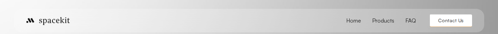
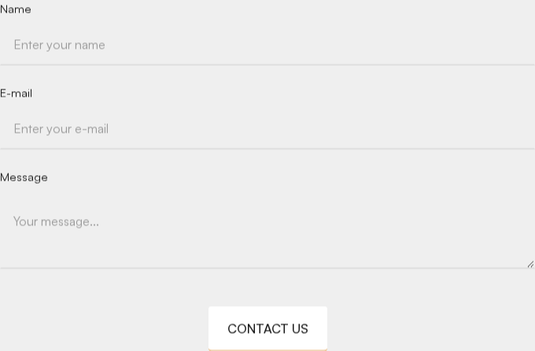

### Variante B — Dunkler Button (`.black-button` — „Shop Now")

| Zustand | Werte |
|---|---|
| Normal | `background: #000000; color: #FFFFFF; border-radius: 4px (.25rem); padding: 16px 32px; font: 16px/24px Satoshi 400, uppercase` |
| Hover | `transform: translate(0, 3px)` (Button verschiebt sich 3 px nach unten); `border-bottom-width` ändert sich technisch auf 4px, ist aber unsichtbar, da kein sichtbarer Rahmenstil gesetzt ist; `transition: all .25s ease` |
| Focus | Browser-Default-Outline |
| Active | Wie Hover (keine separate Active-Regel) |
| Disabled | Nicht vorhanden |

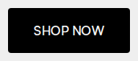

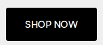

### Variante C — Pill-Tag-Link mit Pfeil (`.read-more-tag` — „More Products | See more →")

| Zustand | Werte |
|---|---|
| Normal | `background: #EFEFEF; color: #000000; border-radius: 37px (2.3125rem, voll gerundet); padding: 8px 12px; font: 16px/24px Satoshi 400`, Trenner-Strich `#3F3F3F` 1px |
| Hover | Pfeil-Icon verschiebt sich minimal (Transform-Matrix-Delta ~0px, dembrandt-Messung: `matrix(1,0,0,1,0,0)` → praktisch kein sichtbarer Sprung, Opacity-Wechsel des rechten Teils) |
| Focus | Browser-Default-Outline |

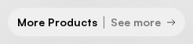
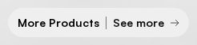
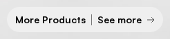

### Textlink / Sekundär-CTA (`.secondary-button`, z. B. „See Details →")

Reiner Text-Link ohne Fläche: Farbe `#151515`, mit Pfeil-Icon rechts (`.arrow-wrapper`, Gap 16px/1rem), `text-decoration: none`. Nutzt dieselben Link-Hover-Regeln wie Navigationslinks (siehe Abschnitt 7): `opacity: 0.6; transform: translate(0, 1px); transition: all .25s ease`.

### Nav-CTA-Unterschied Link vs. Button
Reine Textlinks (`.nav-link`) verwenden **Opacity + 1px-Verschiebung** als Hover-Effekt, während gefüllte Buttons **Rahmen-/Transform-Änderungen ohne Opacity** nutzen — diese Trennung sollte beim Nachbau beibehalten werden.

---

## 6. Formulare & Inputs

Formularfelder sind **unterlinien-basiert** (kein umschließender Rahmen, kein Hintergrund) — typografisch reduziert:

| Zustand | Werte |
|---|---|
| Leer/Default | `background: transparent; border: 1px solid; sichtbar nur unten: rgba(21,21,21,0.15) (border-bottom); border-radius: 0; padding: 25.6px 12px 25.6px 16px; font: 16px Satoshi 400; color: #000000; Placeholder-Farbe: hellgrau` |
| Fokus | Kein sichtbarer, selbst definierter Fokusrahmen (`outline: none` im CSS) — nur der Browser-Default reagiert; **Empfehlung für Nachbau:** eigenen sichtbaren Fokusindikator ergänzen (Barrierefreiheits-Lücke im Original) |
| Ausgefüllt | Visuell identisch zu Default, nur mit Text statt Placeholder |
| Fehler (nativ, `reportValidity()`) | Browser-natives Validierungs-Tooltip „Please fill out this field.“ (Chrome-Standard-Sprechblase) — **kein** eigenes Fehler-Styling (keine rote Umrandung o. Ä.) im Template vorhanden |

**Aufbau eines Formularfelds:** Label (`.text-size-medium-vw`, ca. 18px, Satoshi 400/500) über dem Feld, Abstand zwischen Feldern durch Wrapper-Struktur.

**Absende-Button:** Technisch ein natives `<input type="submit">`, das transparent über einem sichtbar gestylten Label-`div` liegt, das exakt die Primär-Button-Optik (Variante A, Abschnitt 5) trägt — Text „Contact us" in `.caps`/`font-weight: 500`.

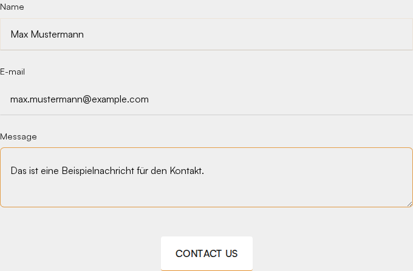
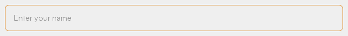
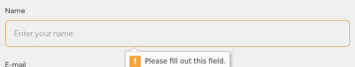

---

## 7. Navigation

### Desktop
Die Navigationsleiste ist eine **freischwebende Glasmorphism-Pille**: Der äußere Wrapper `.navbar` ist `position: fixed; top: 0` (transparent, ohne Radius), darin liegt die sichtbare Pille `.navbar-component` (`position: static`). Sie bleibt beim Scrollen oben am Viewport (verifiziert: `top` = 0 px vor und nach 1500 px Scroll) und **beim Scrollen visuell nicht verändert** — verifiziert per Computed Style vor und nach 500 px Scroll (identische Werte):

- `background-color: rgba(255,255,255,0.22)`
- `backdrop-filter: blur(20px)`
- `border-radius: 22px (1.375rem)`
- `box-shadow: none`
- `padding: 16px 35px 16px 36px`
- Höhe: ca. 69 px

Es gibt **keine** Scrolled-State-Logik (kein Farbwechsel, kein Schatten-Zuwachs) — die Navbar bleibt immer transparent-glasig über dem Seiteninhalt.

**Nav-Link-Hover:** `opacity: 1 → 0.6; transform: translate(0, 1px); transition: all .25s ease`. Der aktive Link (`w--current`) hat volle Opazität ohne Unterstreichung.

### Mobile (≤ 991 px)
Menü ist standardmäßig eingeklappt (Hamburger-Icon rechts, `.w-nav-button`, 24px, Padding 18px). Beim Öffnen erscheint ein **abgesetztes, freischwebendes Panel**:

- `background-color: rgba(255,255,255,0.8)` (`#fffc`)
- `border-radius: 22px (1.375rem)`
- `width: 90vw`, `position: absolute; left/right: 5vw`
- `padding: 32px (2rem)`
- Links zentriert untereinander, CTA-Button („Contact Us") unten im gleichen Stil wie Desktop-Variante A

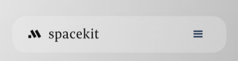
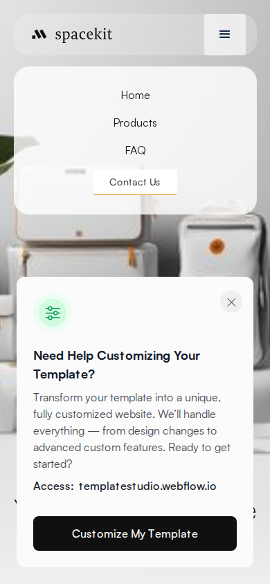

**Animation:** Kein per CSS messbarer Transition-Wert für das Auf-/Zuklappen selbst gefunden (Webflows natives `w-nav`-Standardverhalten, i. d. R. Höhen-Slide ohne dokumentierte Custom-Dauer) — für den Nachbau reicht ein einfacher Slide/Fade von 200–300 ms (Schätzung, orientiert an den übrigen 0.25s-Transitionen der Seite).

---

## 8. Karten, Icons & wiederkehrende Komponenten

| Komponente | Radius | Rahmen | Schatten | Hintergrund | Sonstiges |
|---|---|---|---|---|---|
| Bild-Karte klein/groß (`.card-small` / `.card-big`, Bento-Sektion) | 8 px (.5rem) | 1px solid `rgba(155,143,126,0.4)` (0.1px im Quellcode, real gerendert 1px) | keiner | transparent | `.card-small` 35% Breite, `.card-big` 65% Breite + 40px Innenabstand, beide `height: 50vh` |
| FAQ-Item (`.faq-item`/`.faq-hover`) | 8 px (.5rem) | keiner (nur Hintergrundwechsel) | keiner | transparent → **weiß bei Hover** | Padding 24px (1.5rem); Übergang `background-color .45s ease` (einzige Komponente mit 0.45s statt 0.25s); Chevron-Icon rotiert beim Öffnen |
| Produktkarte (`.product-link`) | 0 px (Bild), Kartenfläche selbst ohne Radius | keiner | keiner | `#FFFFFF` | Bildformat quadratisch, `object-fit: cover`; darunter Meta-Zeile: Name/Variante (`.caps`, 14px) links, Preis rechts |
| Preis-Badge (Produktdetail) | 2 px | 1px solid `#BEBEBE` | keiner | `#FFFFFF` | Padding 10px, Text 16px |
| Trennpunkt (`.elipse`) | 50 % (Kreis) | – | – | `#E28E2A` | 5.6 px Durchmesser (.35rem), z. B. zwischen Tag-Wörtern |
| Icon-System | – | – | – | – | Reine **Inline-SVGs** (Pfeil-Icons `Arrow.svg`, `FAQ Arrow.svg` von Webflow-CDN) statt Icon-Font; keine einheitliche Icon-Bibliothek (kein Feather/Font Awesome erkannt) |

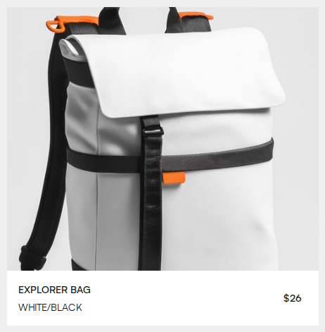
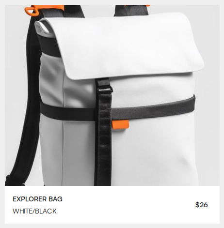
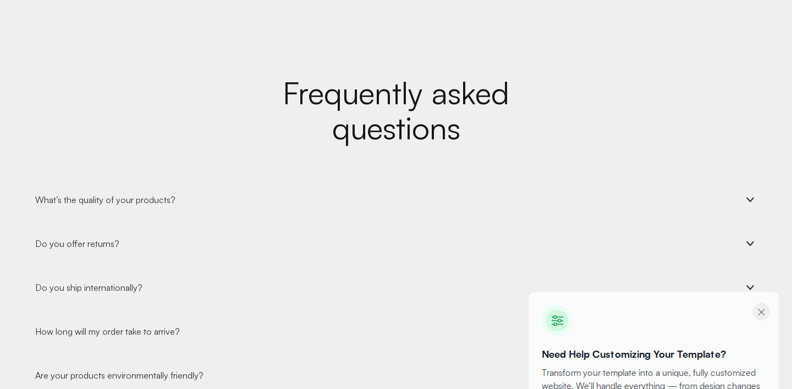
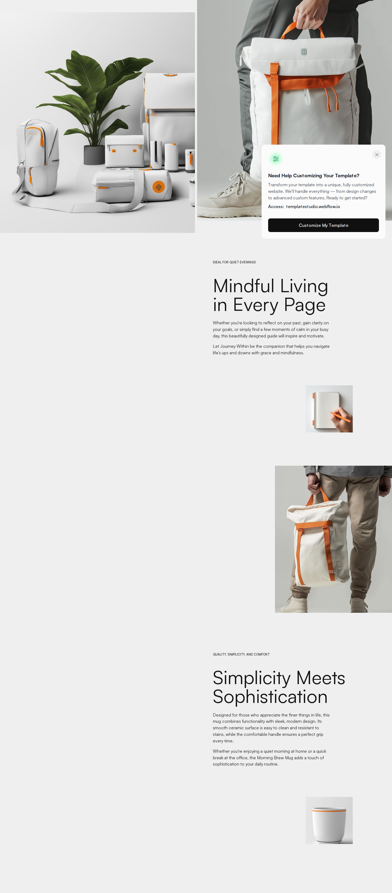

---

## 9. Bildsprache

- **Stil:** Freigestellte/halb-freigestellte Produktfotografie (Taschen, Rucksäcke, Bücher, Tassen) auf neutralem Hellgrau-Studio-Hintergrund, ergänzt durch Lifestyle-Aufnahmen (Person trägt Produkt) in gedämpften, warmen Grautönen. Durchgängiger Akzent: oranges Zubehör/Zipper an den Produkten korrespondiert mit der Marken-Akzentfarbe.
- **Seitenverhältnisse:** Hero-Bild groß, breit (annähernd 16:9 bis 2:1 je nach Viewport); Produktkarten-Bilder **quadratisch (1:1)**; Bento-Bilder unregelmäßig (großformatige Ausschnitte ohne festes Verhältnis, `object-fit: cover`).
- **Overlays/Filter:** Auf der Startseite **keine** Bild-Overlays. Einzige Overlay-Technik im gesamten Projekt: dunkles Verlaufs-Overlay `linear-gradient(0deg, rgba(18,18,18,.39), transparent)` auf der Unterseite „Style Guide" für Textlesbarkeit über Fotos (optionale Technik für neue Hero-Bilder mit Textüberlagerung).
- **Rundungen:** Bilder in Bento-/Card-Kontexten mit `border-radius: 8px`; freistehende Produktfotos im Hero ohne Rundung (freigestellt, kein Rahmen-Container).
- **Icons in Bildern:** kleine weiße Kreis-Sticker mit Symbolen direkt auf Produktfotos (Dekor, kein UI-Element).

---

## 10. Animationen & Übergänge

**Global gemessene Transition-Eigenschaften und -Dauern (aus CSS + Computed Style, dembrandt-Motion-Scan):**

| Kontext | Eigenschaft(en) | Dauer | Easing | Verzögerung/Staffelung |
|---|---|---|---|---|
| Links (Nav, Footer, Textlinks) | `opacity`, `transform` | 0.2s – 0.3s (meist **0.25s**) | `ease` | keine Staffelung |
| Gefüllte Buttons (primär/dunkel) | `all` (Hintergrund, Rahmenbreite, Transform) | **0.25s** | `ease` | keine |
| FAQ-Akkordeon (Hintergrund bei Hover) | `background-color` | **0.45s** | `ease` | keine |
| Promo-Widget-Button | `all` (Transform-Scale 0.98, Opacity des Hintergrunds) | 0.25s | `ease` | keine |
| Übrige, seltener genutzte Werte im Stylesheet | diverse (`opacity`, `all`) | 0.2s / 0.3s / 0.4s | `ease` | – |

**Scroll-Animationen (Webflow-IX2, Inline-Styles/`data-w-id`-Attribute im HTML):** Elemente wie die Hero-Headline, das „More Products"-Tag und Bento-Bilder tragen initiale Inline-Transforms wie `translate3d(0, 10vh, 0)` mit `opacity: 0`, die beim Scrollen in den Viewport über Webflows Interactions-2-Engine auf `translate3d(0,0,0)` / `opacity: 1` animiert werden (klassisches „Fade-Up"-Reveal-Muster). Konkrete Dauer/Easing dieser IX2-Trigger sind nicht als CSS-Transition messbar (sie laufen über von Webflow injizierte JS-Keyframes); als **Schätzung** orientiert an vergleichbaren Webflow-Vorlagen: **Dauer ca. 500–800 ms, Easing „ease-out", Start-Offset ca. 10vh nach unten, keine Verzögerung zwischen einzelnen Elementen** (keine sichtbare Stagger-Sequenz erkannt). Zusätzlich sind einzelne Produktbilder mit `will-change: transform` und leicht skaliertem Ausgangszustand (`scale3d(1.09,1.09,1)`) versehen — deutet auf einen **dezenten Parallax-/Zoom-Effekt beim Scrollen** hin (Bild zoomt beim Einblenden leicht von 109% auf 100%).

**Reduced Motion:** Im Original-Stylesheet keine `prefers-reduced-motion`-Regel gefunden — für einen barrierefreien Nachbau wird empfohlen, eine `@media (prefers-reduced-motion: reduce)`-Regel zu ergänzen, die alle Transition-/Animation-Dauern auf `0.01ms` reduziert (im Original nicht vorhanden, hier als Verbesserungsvorschlag markiert).

---

## 11. Responsive Verhalten

Breakpoints (Webflow-Standard, verifiziert im CSS: `@media screen and (max-width: 991px | 767px | 479px)`, sowie ein zusätzlicher `@media (min-width: 768px)`):

| Breakpoint | Was ändert sich |
|---|---|
| **≥ 992 px (Desktop)** | Container fix 1760px max-width; 3‑spaltiges Produktraster; 2‑spaltige Bento-Reihen; 4‑spaltiger Footer; Navigation inline sichtbar; Sektions-Padding 40px |
| **≤ 991 px (Tablet)** | Container wird prozentual (`90vw`); Navigation klappt in Hamburger-Menü (Glas-Panel, siehe Abschnitt 7); `.bento-row` wechselt auf gestapelte Spalten (`card-small` zuerst); `.heading-1` schrumpft auf 64px, `.heading-2` auf 56px |
| **≤ 767 px (Mobile groß)** | Sektions-Padding sinkt auf 20px; Produktraster wird **einspaltig** (`flex-direction: column`); Footer wechselt auf **2 Spalten** (Gap 64px); `.heading-2` auf 48px; `.heading-vw` auf 40px |
| **≤ 479 px (Mobile klein)** | Sektions-Padding sinkt auf 16px; Footer bleibt mehrspaltig, aber mit reduzierten Gaps (48px/32px) und linksbündiger Ausrichtung; `.heading-1` auf 48px, `.heading-2` auf 44.8px, `.heading-vw` auf 35.2px |

Bildinhalte skalieren durchgängig fluid (`width: 100%`, `object-fit: cover`); es werden keine unterschiedlichen Bildausschnitte (Art Direction) zwischen Breakpoints eingesetzt, nur Größenanpassung über `srcset`.

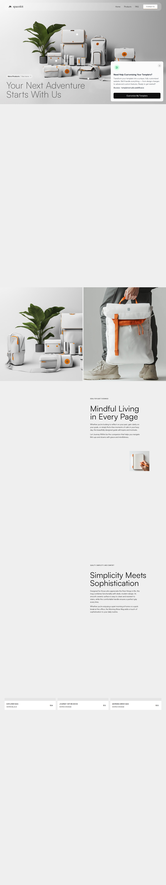
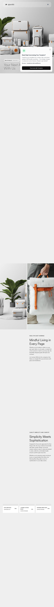
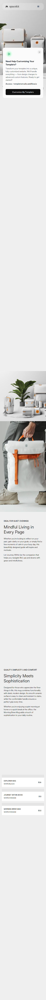

---

## 12. Komponenten-Inventar

- [x] Navigation Desktop (Glas-Pille, fixed) — [Screenshot](screenshots/desktop-header.png)
- [x] Navigation Desktop, gescrollt (visuell identisch) — [Screenshot](screenshots/desktop-header-scrolled.png)
- [x] Navigation Mobile, geschlossen — [Screenshot](screenshots/mobile-header-closed.png)
- [x] Navigation Mobile, geöffnet — [Screenshot](screenshots/mobile-nav-open.png)
- [x] Hero-Sektion mit freigestellter Produktfotografie — [Screenshot](screenshots/desktop-hero.png)
- [x] Feature-Intro-Sektion (2-spaltig, Bild + Text) — [Screenshot](screenshots/desktop-section-features.png)
- [x] Bento-/Highlight-Sektion (65/35-Karten + Bild-Text-Zeilen) — [Screenshot](screenshots/desktop-section-bento.png)
- [x] Produktraster (3-spaltig, Karten) — [Screenshot](screenshots/desktop-section-products.png)
- [x] Produktkarte, Normalzustand — [Screenshot](screenshots/card-product-normal.png)
- [x] Produktkarte, Hover — [Screenshot](screenshots/card-product-hover.png)
- [x] FAQ-Akkordeon — [Screenshot](screenshots/desktop-section-faq.png)
- [x] Footer (4-spaltig, Social-Icons, Rechtliches) — [Screenshot](screenshots/desktop-footer.png)
- [x] Button hell/Primär (Normal/Hover/Focus) — [Screenshot](screenshots/desktop-header.png)
- [x] Button dunkel „Shop Now" (Normal/Hover/Active/Focus) — [Screenshot](screenshots/button-dark-normal.png)
- [x] Pill-Button „See more" (Normal/Hover/Focus) — [Screenshot](screenshots/button-pill-normal.png)
- [x] Kontaktformular, leer — [Screenshot](screenshots/form-empty.png)
- [x] Kontaktformular, ausgefüllt — [Screenshot](screenshots/form-filled.png)
- [x] Formularfeld, Fokus — [Screenshot](screenshots/form-input-focus.png)
- [x] Formularfeld, native Fehlermeldung — [Screenshot](screenshots/form-input-error.png)
- [x] Produktübersichtsseite (gesamte Unterseite) — [Screenshot](screenshots/desktop-fullpage-products.png)
- [x] Produktdetailseite (gesamte Unterseite) — [Screenshot](screenshots/desktop-fullpage-product-detail.png)
- [x] Kontaktseite (gesamte Unterseite) — [Screenshot](screenshots/desktop-fullpage-contact.png)
- [ ] Promo-/Marketplace-Widget „Customize My Template" — **kein Bestandteil des eigentlichen Seiteninhalts**, sondern ein vom Webflow-Template-Marktplatz injiziertes Cross-Sell-Popup (dunkler Button, Radius 8px). Für den Nachbau der eigenen Website **nicht** übernehmen, hier nur der Vollständigkeit halber referenziert: [Screenshot](screenshots/button-promo-widget-normal.png)

---

## Anhang: Quellen der Werte

Alle Werte in diesem Dokument stammen aus einer Kombination von drei Quellen; bei Widersprüchen wurde **Computed Style (Playwright/Chromium, live von der Zielseite)** als verbindliche Wahrheit behandelt:

1. **dembrandt** (`npx dembrandt@latest`, Crawl über 6 Unterseiten `/`, `/products`, `/contact`, `/products/explorer-bag`, `/products/journey-within-book`, `/products/morning-brew-mug`, Flags `--design-md --save-output --html --wcag --tailwind --crawl 6 --slow`): Farbpalette inkl. Nutzungshäufigkeit, WCAG-Kontrastmatrix, Button-/Input-Rohmuster, Motion-Dauern/Easing, Border-Radius-Häufigkeitsverteilung.
2. **SkillUI** (`npx skillui --mode ultra --screens 20`): Struktur-/Komponentenerkennung (wiederkehrende DOM-Muster wie `.faq-item`, `.product-link`), Scroll-Journey-Screenshots, Layout-Grid-Rohwerte. **Hinweis:** Die automatisch generierte Top-Level-`DESIGN.md` von SkillUI enthielt fehlerhafte Aussagen (u. a. „dunkles Theme" mit Hintergrund `#151515` und Überschriften-Font „webflow-icons") — diese wurden durch Computed-Style-Prüfung **widerlegt und korrigiert** (`#151515` ist tatsächlich die Text-, nicht die Hintergrundfarbe; „webflow-icons" ist eine reine Icon-Glyphen-Schrift, keine Überschriften-Schrift). Für dieses Dokument wurden daher nur die strukturellen Referenzdateien (`LAYOUT.md`, `COMPONENTS.md`, `INTERACTIONS.md`) verwendet, nicht die generierte `DESIGN.md`-Farb-/Typografie-Zusammenfassung.
3. **Manuelle Verifikation per Playwright/Chromium** (`getComputedStyle`, direkte Analyse der ausgelieferten Produktions-CSS-Datei `spacekit-template.webflow.75a22ccde.css`): Alle Heading-Skalen, Container-/Grid-Maße, Breakpoints, Button-/Formular-Zustände (Hover per Maus-Move, Fokus per `element.focus()`, Fehlerzustand per `reportValidity()` **ohne** Formularabsendung), Navbar-Scroll-Verhalten, Mobile-Menü-Öffnung.

**Als Schätzung gekennzeichnete Werte** (nicht exakt aus CSS/Computed Style auslesbar, sondern aus Kontextindizien abgeleitet):
- Dauer/Easing der Webflow-IX2-Scroll-Reveal-Animationen (Abschnitt 10) — die zugrunde liegende JS-Engine exponiert keine CSS-Transition-Werte.
- Animationsdauer des Mobile-Menü-Auf-/Zuklappens (Abschnitt 7).
- Proportionale Breakpoint-Skalierung von H3–H6, da im Quell-CSS keine expliziten Override-Regeln für diese Klassen existieren.

**Wichtiger Hinweis:** Die Rohdaten der Extraktions-Läufe (dembrandt-JSON/HTML-Report, SkillUI-Output inkl. `.skill`-Paket, alle Playwright-Skripte und Zwischenergebnisse) liegen **nicht** in diesem Repository, sondern ausschließlich im Session-Scratchpad-Verzeichnis der Erstellungsumgebung. Dieses Dokument sowie die Dateien unter `screenshots/` sind die alleinigen, für das Repository bestimmten Endergebnisse.
